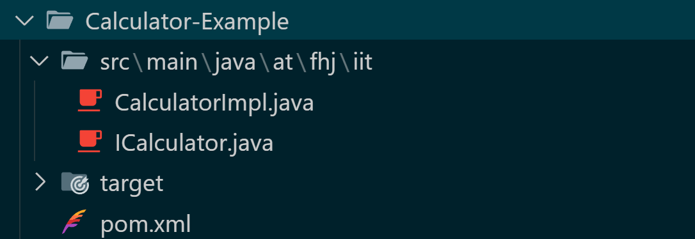

# Calculator

Basic Calculator

## Description

> This is a Basic Calculator who **Adds, Subtracts, Multiplies** and **Divides** two Numbers

## Installation

1. Install the ZIP-File >Calculator-Example
2. Extract the Files where you Downloaded it
3. Installation should be succesfull

## Guidance

Open the Calculator with VS-Code (or other programm).
You then run the programm and type two numbers in the terminal.
This two numbers then get

- Added
- Subtracted
- Divided
- Mulitplied

And you get the Result back in the Terminal (in the Order as shown above)

## Features

You get a Error Message when the Result of the *Division* is either Not a Number (when dividing with zero) or the result is infinite.

## Notes (for Programmers)

The Programm is divided into 2 Java Files, while the ICalculator.java file calls the methods, they are defined in the CalculatorImpl.java file.



## Verlinkundg der Exercise Markdown Dateien

1. [**Exercise 1**](exercise1.md)

   >Erster Einstieg um mit Markdown zu arbeiten/ Markdown kennenlernen. Übungsziel: sich mit der Syntax bekannt machen (Bild einfügen, Link einfügen, Absätze, etc.)

2. [**Exercise 2**](exercise2.md)

      >Einstieg in die Git-Befehle. Übungsziel: Git-Befehle kennerlernen und weiter die Markdown Syntax kennenlernen (z.B. Tabellen einfügen)

3. [**Exercise 3**](exercise3.md)

      >Einstieg zum erstellen erster Maven Projekte und kompilieren sowie ausführen mittels Maven

4. [**Exercise 4**](exercise4.md)
      >Einstieg zur erstellen von Testen mit JUnit, also  ganz Basic, dass man das Ergebnis einer Methode mit dem Ergebnis das rauskommen sollte (wenn die Methode richtig implemeiert worden ist)

5. [**Exercise 5**](exercise5.md)
      >Einstieg in das Erstellen, Ändern und Arbeiten mit verschiedenen Branches sowie das Arbeiten mit der logging bibliothek

      <br>
>    [Template der log4j2.xml Datei](src/main/resources/log4j2.xml.template)
<br>

6. [**Exercise 6**](exercise6.md)
      > Einstieg ins Benutzen von Javadoc Kommentaren sowie generieren von Maven Site Dokumentationen und generell Dokumentation und arbeiten mit anderen Branches üben.

## Link zur GitHub Profilseite und Hochschule

[GitHub Profilseite](https://github.com/casper-zielinski)

[Hochschule](https://www.fh-joanneum.at/)

## Wie die log4j2.xml Datei aussieht (Template)


```
<?xml version="1.0" encoding="UTF-8"?>
<Configuration status="WARN">
 <Appenders>
 <!-- Ausgabe auf Konsole -->
 <Console name="Console" target="SYSTEM_OUT">
 <PatternLayout pattern="%d{HH:mm:ss} [%t] %-5level %logger{36}
- %msg%n" />
 </Console>
 <!-- Logdatei-Ausgabe -->
 <File name="FileLogger" fileName="logs/app.log" append="true">
 <PatternLayout>
 <pattern>%d{yyyy-MM-dd HH:mm:ss} %-5level %c{1} -
%msg%n</pattern>
 </PatternLayout>
 </File>
 </Appenders>
 <Loggers>
 <!-- Root Logger -->
 <Root level="debug">
 <AppenderRef ref="Console"/>
 <AppenderRef ref="FileLogger"/>
 </Root>
 </Loggers>
</Configuration>
```

<h3>Das Resultat:</h3>

```
2025-04-03 14:03:50 INFO  Calculator -
divide called with: number1 =10.0, number2 =0.0
2025-04-03 14:03:50 ERROR Calculator -
Division called with 0!

...
```
Es liefert die Lognachrichten in die app.log Datei, wobei wenn man die Test noch mal ausführt die Datei nicht überschriben wird sondern es zu ihr angesetzt wird (**append**)

