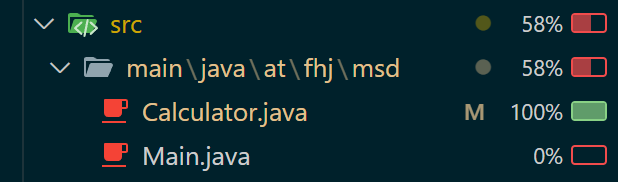
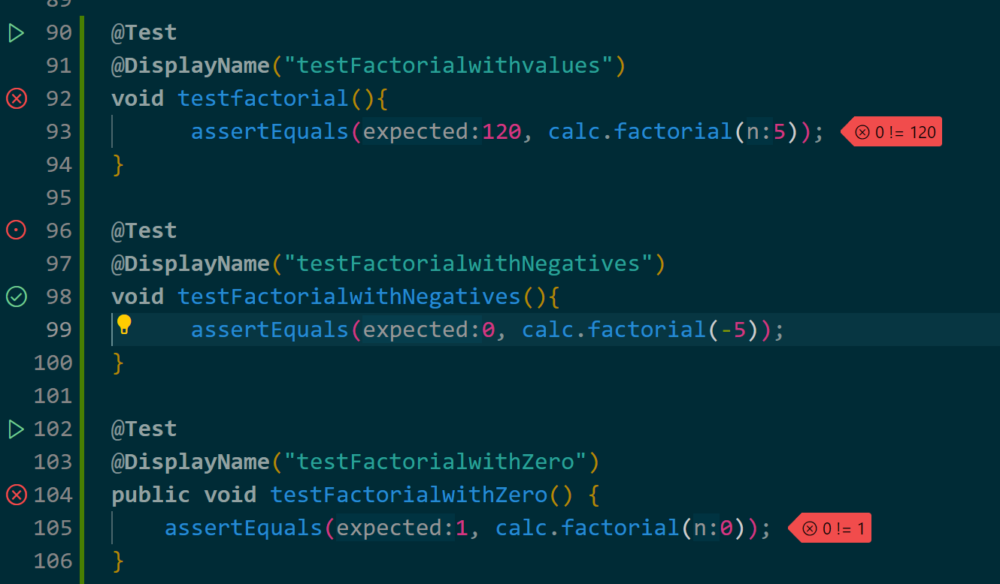

# Exercise 4

> Arbeiten mit Test's

## Test Methoden

```
@Test
@DisplayName("testAddNormalValues()")
void testAddition() {
 assertEquals(5, calc.add(2,3));
}
```
>Überpüft mit normalen Werten die Additions Methode

```
@Test
@DisplayName("testAddWithZero()")
void testAdditionWithZero(){
 assertEquals(0, calc.add(0,0));
}
```
>Überprüft mit 0 die Additions Methode

```
@Test
@DisplayName("testAddWithNegative()")
void testAddWithNegative(){
      assertEquals(1, calc.add(-2,3));
}
```
>Überprüft die Additions Methode mit negativen Werten


```
@Test
@DisplayName("testDivideNormalValues()")
void testDivideNormalValues(){
      assertEquals(5, calc.divide(10,2));
}
```
>Überprüft die Divisions Methode mit normalen Werten

```
@Test
@DisplayName("testDivideByZero()")
void testDivideByZero(){
      assertThrows(ArithmeticException.class , () -> calc.divide(10, 0));
}
```
>Überprüft ob die Divisions Methode mit 0 eine Exception wirft (Ein Wert / 0)

```
@Test
@DisplayName("testDivideWithZero")
void testDivideWithZero(){
      assertEquals(0, calc.divide(0, 10));
}
```
>Überprüft ob die Divisions Methode mit 0 den richtigen Wert zurückgibt, diesmal aber in dieser Form: (0 / Wert)

```
@Test
@DisplayName("testMuliplyNormalValues()")
void testMuliplyNormalValues(){
      assertEquals(20, calc.multiply(5, 4));
}
```
>Überprüft die Multiplikations Methode mit normalen Werten

```
@Test
@DisplayName("testMultiplycommutative")
void testMultiplycommutative(){
      assertEquals(calc.multiply(4, 2), calc.multiply(2, 4));
}
```
>Überprüft das Kommutativ Gesetzt der Multiplikation (also das: x * y = y * x)

```
@Test
@DisplayName("testMultiplyWithZero")
void testMultiplyWithZero(){
      assertEquals(0, calc.multiply(100, 0));
}
```
>Überprüft die Multiplikations Methode mit dem Wert 0

```
@Test
@DisplayName("testMinusNormalValues")
void testMinusNormalValues(){
      assertEquals(10, calc.minus(20, 10));
}
```
>Überprüft die Subtraktions Methode mit normalen Werten

```
@Test
@DisplayName("testMinusWihtZero")
void testMinusWihtZero(){
      assertEquals(10, calc.minus(0, 10));
}
```
>Überprüft die Subtraktions Methode mit dem Wert 0

```
@Test
@DisplayName("testMinusNegatives")
void testMinusNegatives(){
      assertEquals(-20, calc.minus(-10, 10));
}
```
>Überprüft die Subtraktions Methode mit einem negativen Wert

## Test with Coverages




