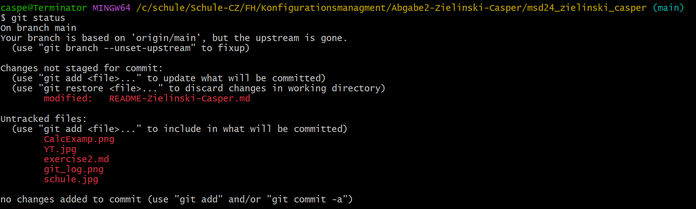
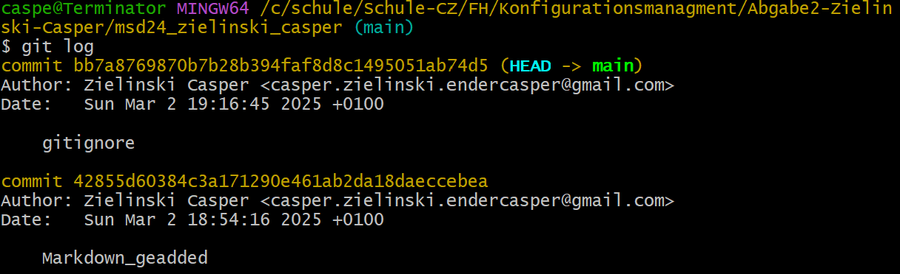

# Git Befehle erklärt

| Befehl | Erklärung |
| -------------- | ------------- |
| **git config** | *wird benutzt, um Git-Konfigurationseinstellungen zu setzten, anzupassen oder abzufragen (Bsp: Namen ändern, E-mail Adresse ändern etc.)* |
| **git init** | *initalisiert ein Git Repository lokal* |
| **git commit** | *Nachdem alle veränderten bzw. neuen Dateien in den Staging Bereich hinzugefügt werden, können diese Veränderungen vom Staging Bereich in das Git Repository als eine neue Version hinzugefügt werden* |
| **git status** | *aktuellen Status des Git Repositorys aufrufen*  |
| **git add** |*fügt eine Datei erstamlig oder nach Veränderung zum Git Staging Bereich des Repositorys hinzu* |
| **git log** | *Nach einem Commit kann man mit log Informationen des letzten Commits, bzw. die Beziehung zu vorherigen Commits darstellen* |
| **git diff** | *Unterschiede zwischen commits oder Commit und working directory anzeigen lassen* |
| **git pull** | *Die aktuelle Version wird vom Server geholt und die Dateien aktualisiert* |
| **git push** | *Dateien des lokalen Repositories werden an der Server geschickt* |

## Wie ein `git log` und `git status` aussieht

`git status`

`git log`

## Wie man Namen und E-mail ändert (Global und Lokal)

- Global:

      git config --global user.name "Neuer Name"
      git config --global user.email "neue.email@example.com"

- Lokal:

      git config --local user.name "Neuer Name"
      git config --local user.email "neue.email@example.com"
      
