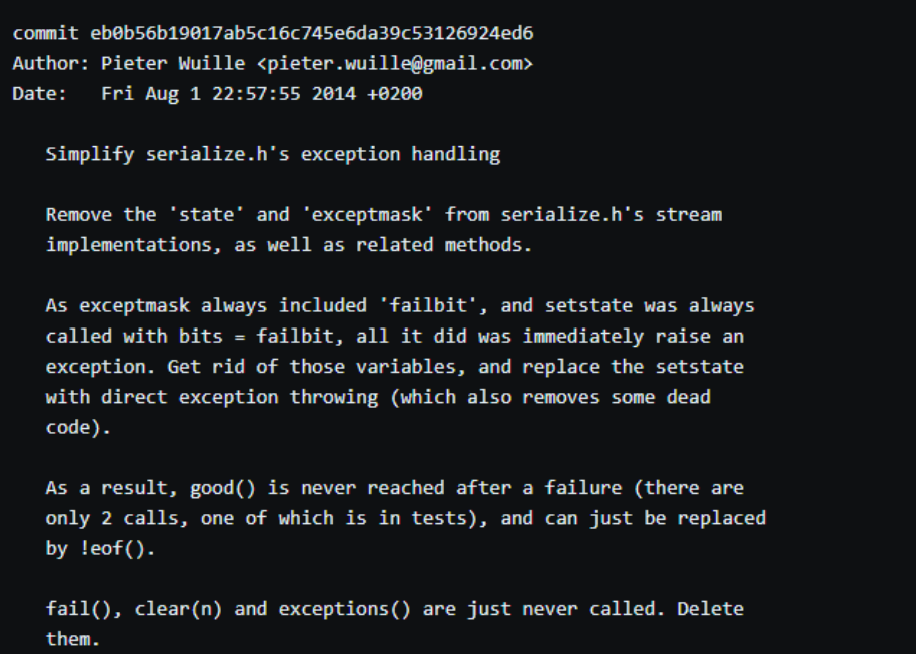

# **Wie verfasst man gute Source Code Kommentare bzw. gute Git Commit Messages**

<h2>Code is more often read than written</h2>
<p><em>Guido van Rossum</em></p>

## **7 Regeln für gute Git Commit Messages**

**1. Trennung zwischen Zusammenfassung/Überschrift und Haupttext**

 - Eine kurze Zusammenfassung oder Überschrift steht in der ersten Zeile
 - Danach folgt eine leere Zeile
 - Dann kommt der eigentliche Test (Details zur Änderung)
 - Wenn die Nachricht sehr kurz ist, reicht oft nur die erste Zeile mit der Zusammenfassung

**2. Kurze Zusammenfassung/Überschrift mit weniger als 50 Zeichen**

 - Als grobe Regel: Die Überschrift sollte unter 50 Zeichen lang sein
 - Wenn das nicht möglich ist, könnte es sein, dass zu viele Änderungen in einem Commit sind

**3. Kurze Zusammenfassung/Überschrift beginnt mit einem Großbuchstaben**

 - Die erste Zeile (Überschrift) sollte mit einem Großbuchstaben anfangen
 - Das wirkt strukturiert und ordentlich

**4. Kein Punkt am Ende der kurzen Zusammenfassung/**

 - Am Ende der ersten Zeile kein Punkt (.) setzen
 - Die Überschrift ist eine kurze Aussage, kein ganzer Satz

**5. In der Zusammenfassung den Imperativ (Befehlsform) verwenden**

 - Die Überschrift sollte in der Befehlsform geschrieben sein, so als würdest du sagen, was getan weden soll
 - Eine gute Orientierung: Die Zeile sollte diesen Satz sinnvoll ergänzen können:  
 "Wenn dieser Commit angewendet wird, dann ..." 
 - Gute Beispiele: 
 ```
 Merge branch "feature42"
 Refactor subsystem X for readability
 Update getting started documentation
 Remove deprecated methods
 Release version 1.0.0
 ```

**6. Im Haupttext nach 72 Zeichen ein Zeichnumbruch machen**

 - Der Text bleibt so besser lesbar ind der Konsole
 - Viele Tools erwarten oder formatieren Texte auch so - ist also eine Art Standard

**7. Im Haupttext beschreiben, was und warum - nicht wie**

 - Im ausführlichen Text soll erklärt werden: Was wurde geändert? und Warum wurde es geändert
 - Ziel ist es, später zu verstehen, welche Entscheidung getroffen wurde und warum
 
Gutes Beispiel:



## 9 Regeln für gute Source Code Kommentare

**1. Kommentare sollen den Code nicht duplizieren**

 - ``if (x > 3) { … } // if x is bigger than 3``

**2. Gute Kommentare entschuldigen keinen unklaren Code**

**3. Wenn du keinen klaren Kommentar schreiben kannst, könnte es ein Problem mit dem Code geben**

- >Debugging is twice as hard as writing the code in the first place. Therefore, if you write the code as cleverly as possible, you are, by definition, not smart enough to debug it.

**4. Kommentare sollten Verwirung beseitigen, nicht verursachen**

- ``x = 1750 // RIPJSB``

**5. Erkläre unidiomatischen Code in Kommentaren**

 - Unidomatischer Code ist Code, der nicht in den gängigen Praktiken oder Konventionen der Programmiersprache folgt.

**6. Links zur Originalquelle von kopiertem Code angeben**

 - Dient nicht nur der Ehrlichkeit, sondern hilft dabei, Nachvollziehbarkeit und Urheberrecht zu wahren
 - Damit andere Entwickler die Quelle überprüfen können, wenn nötig

**7. Links zu externen Referenzen dort einfügen, wo sie am hilfreichsten sind**

 - Externe Links sollten im Code oder in Kommentaren so plaziert werden, dass sie den nächsten Entwickler direkt zu wichtigen Informationen oder Ressourcen führen

**8. Kommentare hinzufügen, wenn Bugs behoben werden**

 - Diese Kommentare helfen anderen Entwicklern (und sich selbst in der Zukunft) zu verstehen, warum eine bestimmte Lösung gewählt wurde

**9. Kommentare verwenden, um unvollständige Implementierungen zu kennzeichnen**

  - Solche Kommentare verhindern, dass andere Entwickler den unvollständigen Code verwenden, ohne zu wissen, dass er noch nicht fertig ist
